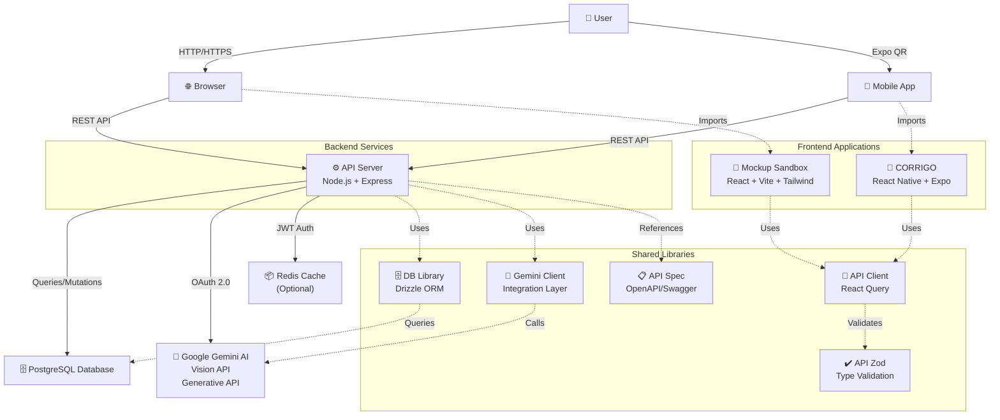
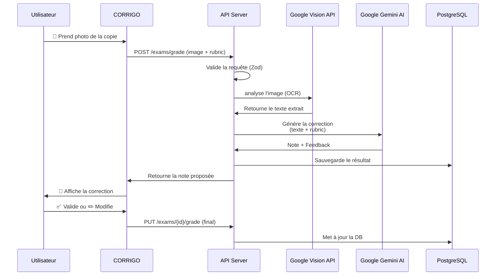
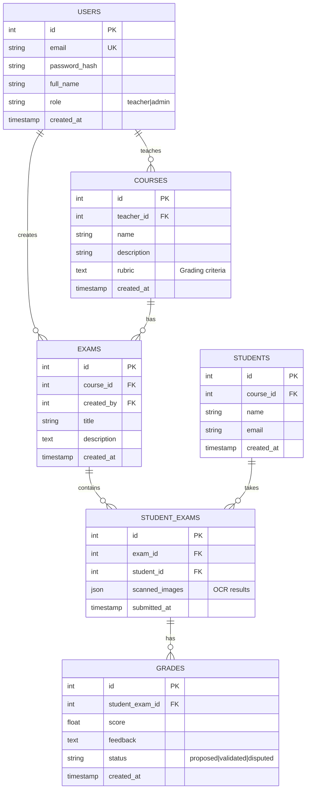
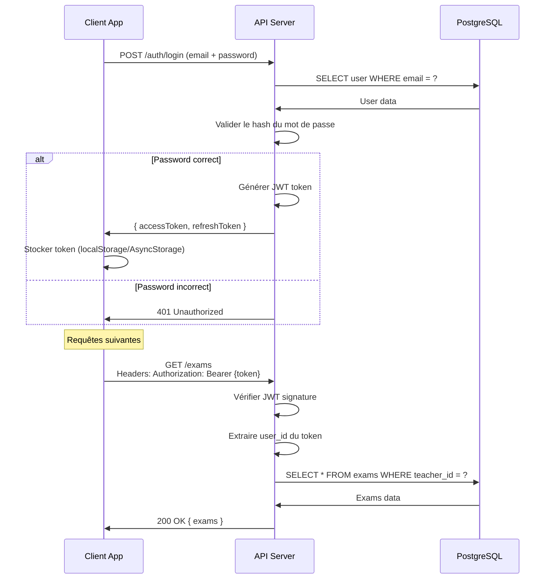
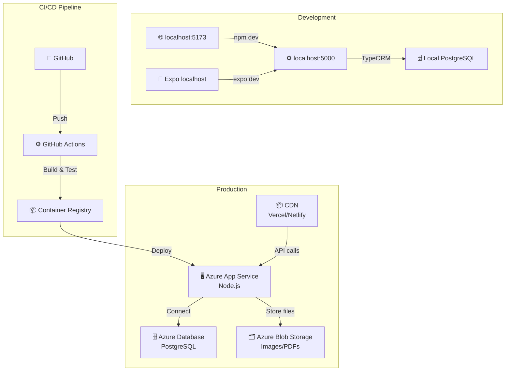

# 🏗️ Architecture - Corrigo

Vue d'ensemble complète de l'architecture de **Corrigo**.

---

## 📊 Diagramme d'Architecture Global



---

## 🏢 Structure des Dossiers

```
Corrigo/
├── artifacts/                 # Applications déployables
│   ├── api-server/           # Backend principal
│   │   ├── src/
│   │   │   ├── app.ts        # Configuration Express
│   │   │   ├── index.ts      # Point d'entrée
│   │   │   ├── routes/       # Endpoints API
│   │   │   │   ├── auth.ts   # Authentification
│   │   │   │   ├── courses.ts # Gestion des cours
│   │   │   │   ├── exams.ts  # Correction des examens
│   │   │   │   ├── ai.ts     # Endpoints IA
│   │   │   │   └── health.ts # Health check
│   │   │   ├── middlewares/  # Express middlewares
│   │   │   └── lib/
│   │   │       └── logger.ts # Pino logging
│   │   ├── build.mjs         # Build script (esbuild)
│   │   ├── tsconfig.json
│   │   └── package.json
│   │
│   ├── mockup-sandbox/       # Frontend React
│   │   ├── src/
│   │   │   ├── App.tsx       # Composant racine
│   │   │   ├── main.tsx      # Entrée React
│   │   │   ├── index.css     # Styles globaux
│   │   │   ├── components/   # Composants réutilisables
│   │   │   │   └── ui/       # Shadcn UI components
│   │   │   ├── hooks/        # React hooks
│   │   │   └── lib/
│   │   │       └── utils.ts  # Utilitaires
│   │   ├── vite.config.ts    # Configuration Vite
│   │   └── tailwind.config.ts # Configuration Tailwind
│   │
│   └── corrigo/              # Mobile App (React Native)
│       ├── app/              # Expo Router screens
│       │   ├── (auth)/       # Écrans authentification
│       │   ├── (tabs)/       # Écrans principaux
│       │   ├── course/       # Détails course
│       │   ├── exam/         # Détails exam
│       │   └── grading/      # Correction
│       ├── components/       # Composants React Native
│       ├── contexts/         # Context API
│       │   ├── AuthContext.tsx
│       │   └── DataContext.tsx
│       ├── hooks/            # Hooks custom
│       ├── lib/              # Utilitaires
│       │   ├── api.ts        # Appels API
│       │   ├── storage.ts    # AsyncStorage
│       │   └── types.ts      # Types TypeScript
│       └── app.json          # Configuration Expo
│
├── lib/                       # Bibliothèques partagées (Monorepo)
│   ├── api-spec/             # Spécification API
│   │   ├── openapi.yaml      # Spec OpenAPI
│   │   └── orval.config.ts   # Config génération client
│   │
│   ├── api-client-react/     # Client API généré
│   │   ├── src/
│   │   │   ├── custom-fetch.ts
│   │   │   ├── index.ts
│   │   │   └── generated/    # Code généré par orval
│   │   └── package.json
│   │
│   ├── api-zod/              # Validation Zod schemas
│   │   ├── src/
│   │   │   ├── index.ts
│   │   │   └── generated/    # Schemas générés
│   │   └── package.json
│   │
│   ├── db/                   # Base de données
│   │   ├── src/
│   │   │   ├── index.ts      # Exports DB
│   │   │   └── schema/       # Drizzle schemas
│   │   ├── drizzle.config.ts
│   │   └── package.json
│   │
│   └── integrations-gemini-ai/ # Client IA Gemini
│       ├── src/
│       │   ├── client.ts     # Client Gemini API
│       │   ├── index.ts
│       │   ├── batch/        # Batch operations
│       │   └── image/        # Image processing
│       └── package.json
│
├── scripts/                   # Utilitaires de build/deploy
├── pnpm-workspace.yaml       # Config monorepo
├── tsconfig.base.json        # Config TypeScript partagée
└── package.json              # Dépendances root
```

---

## 🔄 Data Flow - Correction d'Examen



---

## 🗂️ Schéma Base de Données (Simplifié)



---

## 🔐 Authentification & Autorisation

### Flow JWT



### Modèle RBAC

```
Rôles:
├── teacher
│   ├── Créer/Éditer ses propres cours
│   ├── Créer/Éditer ses propres examens
│   ├── Valider les notes proposées
│   └── Exporter les résultats
│
├── admin
│   ├── Tous les droits du teacher
│   ├── Gérer les utilisateurs
│   └── Voir les statistiques
│
└── student
    ├── Voir ses notes
    ├── Télécharger ses résultats
    └── Contester une note
```

---

## 🚀 Déploiement Architecture



---

## 🔌 Points d'Intégration Externe

### Google Cloud APIs

```
┌─────────────────────────────────────┐
│  Google Cloud Console               │
│  ├─ Generative Language API         │
│  │  └─ Base URL: generativelanguage.googleapis.com
│  ├─ Cloud Vision API                │
│  │  └─ Pour OCR (Vision)
│  └─ Docs API (future)               │
│     └─ Pour générer des PDFs
└─────────────────────────────────────┘
       ↑
       │ API Key
       ↓
┌─────────────────────────────────────┐
│  API Server                         │
│  └─ lib/integrations-gemini-ai     │
│     ├─ client.ts (initialisation)   │
│     ├─ batch/ (traitement par lot)  │
│     └─ image/ (vision)              │
└─────────────────────────────────────┘
```

---

## 📊 Stack Technique par Couche

| Couche | Technologies | Raison |
|--------|--------------|---------|
| **Frontend** | React, TypeScript, Vite, Tailwind CSS | Modern, performant, type-safe |
| **Mobile** | React Native, Expo | Code sharing avec le web |
| **Backend** | Node.js, Express, TypeScript | JavaScript partout, rapide |
| **Database** | PostgreSQL | Robust, relatif, scalable |
| **ORM** | Drizzle | Type-safe, moderne |
| **Validation** | Zod | Runtime validation + TypeScript |
| **API Generation** | Orval | Sync OpenAPI + Types |
| **State Management** | React Query | Sync serveur-client optimal |
| **Styling** | Tailwind CSS + Shadcn/ui | Composants réutilisables |
| **Build** | Vite, esbuild | Très rapide |
| **Logging** | Pino | Performance logging |
| **IA** | Google Gemini + Vision API | Accessible, puissant |

---

## 🔄 Workflow des Dépendances

```
pnpm-workspace.yaml
├─ Définit les workspace packages
└─ Définit les versions partagées (catalog)

lib/
├─ api-spec/
│  └─ Définit les types OpenAPI
├─ api-zod/
│  └─ Génère schemas Zod depuis OpenAPI
├─ api-client-react/
│  └─ Génère client React Query depuis OpenAPI
└─ db/
   └─ Definit le schéma Drizzle

artifacts/
├─ api-server
│  ├─ Dépend de: db, api-zod, integrations-gemini-ai
│  └─ Déploie: Node.js backend
├─ mockup-sandbox
│  ├─ Dépend de: api-client-react
│  └─ Déploie: React web
└─ corrigo
   ├─ Dépend de: api-client-react
   └─ Déploie: React Native mobile
```

---

## 🎯 Points d'Extension Futurs

### 1. Authentification OAuth 2.0
```typescript
// Remplacer JWT local par OAuth (Google, Microsoft)
- lib/auth-oauth/
```

### 2. Notifications Real-time
```typescript
// Ajouter WebSocket pour live updates
- Utiliser Socket.io ou ws
```

### 3. Batch Processing
```typescript
// Pour traiter plusieurs copies à la fois
- Bull Queue + Redis
```

### 4. Export Advanced
```typescript
// PDF, Excel, Google Classroom
- lib/export-suite/
```

### 5. Analytics Dashboard
```typescript
// Dashboard admin avec statistiques
- Utiliser Recharts + analytics SDK
```

---

## 📚 Ressources Supplémentaires

- [Architecture Decision Records (ADRs)](./docs/adr/) - Justifications des choix tech
- [API Documentation](./lib/api-spec/openapi.yaml) - Spec OpenAPI complète
- [Database Migrations](./lib/db/migrations/) - Historique des changements BD
- [Performance Guide](./docs/performance.md) - Optimisations et benchmarks

---

**Questions sur l'architecture ?** Ouvrez une [Discussion](https://github.com/Mardo-k12/Corrigo/discussions) ! 🚀
